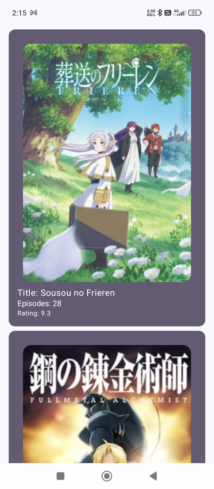
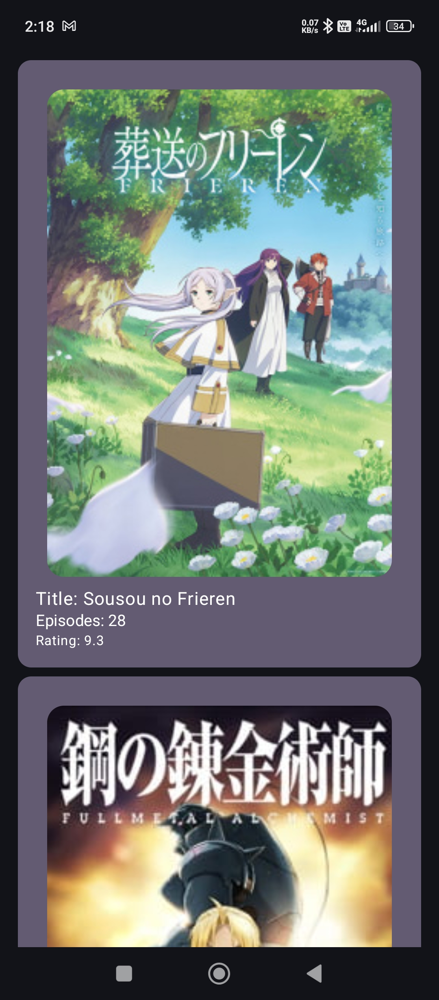
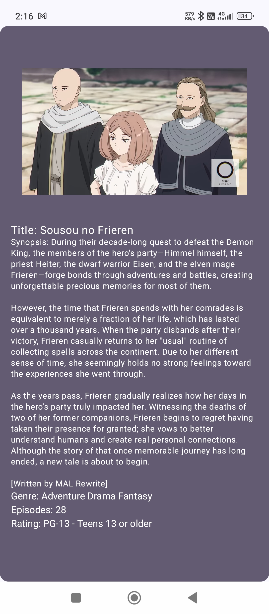
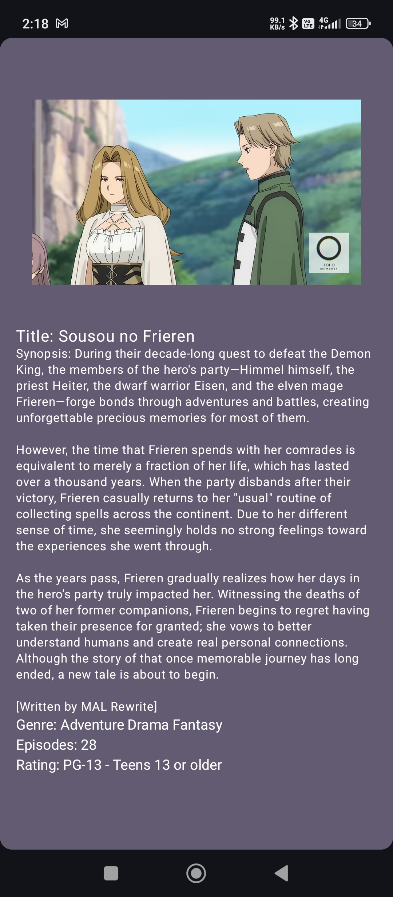

Features Implemented
1) Jetpack Compose UI
2) API Integration using Retrofit
3) Navigation between Anime List and Details screens
4) MVVM Architecture with ViewModel & Model and View
5) Smooth UI with vertical scrolling & click events

Repo Link:
git clone https://github.com/your-username/your-repo-name.git 

Limitations:
1) Api request taking more time to fetch data
2) cast data not fount in json response 

Note: In the app/release path you can find the apk file

Note: I have tried my best to complete this assignment even though iam loaded with task in my current job

thankyou

AnimeList Screen - Light

AnimeList Screen - Dark

AnimeDetails Screen - Light

AnimeDetails Screen - Dark

